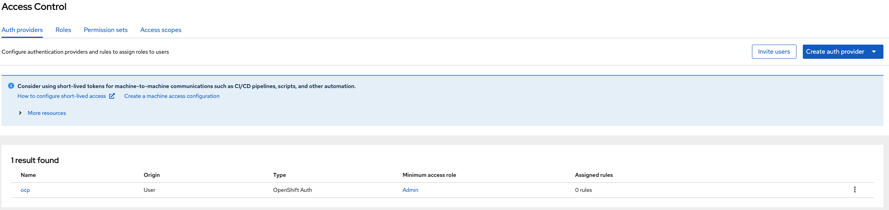
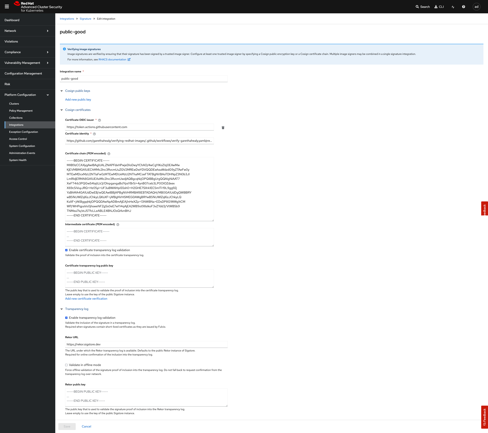
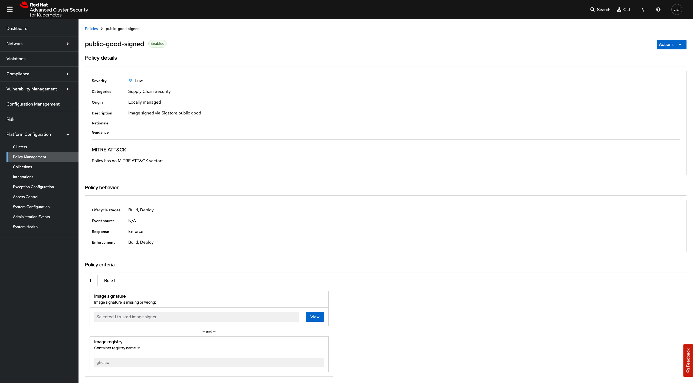

# verifying-redhat-images

Examples of how to verify Red Hat images from [https://catalog.redhat.com](https://catalog.redhat.com/search?searchType=containers&partnerName=Red%20Hat&p=1)

## Cosign
`cosign` can be used to verify image signatures, see: [.github/workflows/verify-redhat.yaml](https://github.com/garethahealy/verifying-redhat-images/blob/main/.github/workflows/verify-redhat.yaml#L24-L31)

## Podman
`podman` can be configured via its [policy.json](samples/HOME/.config/containers/policy-ubi9.json) and [registries.yaml](samples/HOME/.config/containers/registries.d/sigstore-registries.yaml)
to only allow signed images, see: [.github/workflows/verify-redhat.yaml](https://github.com/garethahealy/verifying-redhat-images/blob/main/.github/workflows/verify-redhat.yaml#L44-L72)

## Skopeo

Since `skopeo` uses the same core [libraries](https://github.com/containers) as podman (_and buildah for that matter_),
we can use the same [policy.json](samples/HOME/.config/containers/policy-ubi9.json) and [registries.yaml](samples/HOME/.config/containers/registries.d/sigstore-registries.yaml)
to only allow signed images to be copied from one registry to another, see: [.github/workflows/verify-redhat.yaml](https://github.com/garethahealy/verifying-redhat-images/blob/main/.github/workflows/verify-redhat.yaml#L85-L108)

## OCP >= 4.18 - ClusterImagePolicy

For OCP 4.18, a new feature called ImagePolicy is [Tech Preview](https://docs.redhat.com/en/documentation/openshift_container_platform/4.18/html-single/nodes/index#nodes-sigstore-configure-parameters_nodes-sigstore-using).
As its [TP](https://access.redhat.com/support/offerings/techpreview/), a feature gate needs to be enabled which *STOPS* future cluster upgrades, so only do this on a sandbox cluster.

```bash
oc apply -f samples/ocp/FeatureGates.yaml
oc get ClusterImagePolicy/openshift --watch=true

oc get ClusterImagePolicy/openshift -o yaml
```

Now the core OCP components images are validated against the Red Hat public key.

## OCP >= 4.18 - ImagePolicy

If you want to validate your own images, see [garethahealy_fulcio.yaml](samples/ocp/ImagePolicy/garethahealy_manually_fulcio.yaml) as an example.

Firstly, lets create an image that is manually signed:

```bash
podman build . -t ghcr.io/garethahealy/verifying-redhat-images/example:manaully-signed --platform linux/amd64
podman push ghcr.io/garethahealy/verifying-redhat-images/example:manaully-signed

export IMAGE_SHA=$(cosign triangulate --type='digest' ghcr.io/garethahealy/verifying-redhat-images/example:manaully-signed)

cosign sign -y ${IMAGE_SHA}

yq --inplace '.spec.template.spec.containers[0].image = env(IMAGE_SHA)' samples/ocp/Deployments/garethahealy.yaml
```

Now, we need to collect the public certificates we need to validate against using the `ImagePolicy`:

```bash
cosign initialize

tuf-client init https://tuf-repo-cdn.sigstore.dev ~/.sigstore/root/tuf-repo-cdn.sigstore.dev/root.json

tuf-client get https://tuf-repo-cdn.sigstore.dev fulcio_v1.crt.pem > fulcio_v1.crt.pem
tuf-client get https://tuf-repo-cdn.sigstore.dev fulcio_intermediate_v1.crt.pem > fulcio_intermediate_v1.crt.pem

curl --header 'Content-Type: application/x-pem-file' https://rekor.sigstore.dev/api/v1/log/publicKey > rekor.pub

export FULCIO_CA=$(awk '{print $0}' fulcio_*.pem | base64 -w 0)
export REKOR_KEY=$(cat rekor.pub | base64 -w 0)

yq --inplace '.spec.policy.rootOfTrust.fulcioCAWithRekor.fulcioCAData = env(FULCIO_CA), .spec.policy.rootOfTrust.fulcioCAWithRekor.rekorKeyData = env(REKOR_KEY)' samples/ocp/ImagePolicy/garethahealy_manually_fulcio.yaml
```

Then lets create the OCP bits:

```bash
oc new-project playground

oc apply -f samples/ocp/ImagePolicy/garethahealy_manually_fulcio.yaml
oc apply -f samples/ocp/Deployments/garethahealy.yaml

oc get pods --watch=true
```

Hopefully, you should have a running pod - doing not much, as its just sleeping.

To validate the ImagePolicy is working correctly, lets patch the Deployment with an unsigned image:

```bash
oc patch deployment garethahealy --type='json' -p='[{"op": "replace", "path": "/spec/template/spec/containers/0/image", "value":"ghcr.io/garethahealy/verifying-redhat-images/example:unsigned"}]'
```

Now looking at the running pods, we should see the signed (_working correctly_) and the unsigned pod showing a `SignatureValidationFailed` status:

```bash
oc get pods --watch=true

NAME                            READY   STATUS                      RESTARTS   AGE
garethahealy-765f5b78fc-95x55   0/1     SignatureValidationFailed   0          3s
garethahealy-85d95f4c8d-vstks   1/1     Running                     0          40s
```

Now, you are probably wondering; _why did we manually sign the image and not use the GitHub Action signed image?_
It's due to design decisions highlighted in the [code](https://github.com/containers/image/blob/v5.36.1/signature/fulcio_cert.go#L173-L181)
and [pull request](https://github.com/containers/image/pull/2235) showing the lack of support to validate against Fulcio URI SAN
metadata.

The TLDR is; `containers/image` only supports validating against the [email SAN](https://search.sigstore.dev/?logIndex=406429900) and
does not support [URL SAN](https://search.sigstore.dev/?logIndex=406064670) which is used by GitHub Actions and Fulcio.

## ACS Signature Integration

As part of ACS [4.8](https://docs.redhat.com/en/documentation/red_hat_advanced_cluster_security_for_kubernetes/4.8/html/operating/verify-image-signatures#securing-container-images-by-using-signature-integration_verify-image-signatures) support for Sigstore keyless
verifcation has been implemented. The below steps provide an example of verifying an image signed by the public good instance.

Firstly, lets create an Auth Provider in ACS:



And login via `roxctl`:

```bash
export ROX_ENDPOINT="$(oc get route/central -n stackrox -o json | jq -r '.status.ingress[0].host'):443"

roxctl central login --endpoint=${ROX_ENDPOINT}
```

Now, lets create a [Signature Integration](samples/acs/signature-integration.json):

- OIDC Issuer: `https://token.actions.githubusercontent.com`
- Certificate Identity: `https://github.com/garethahealy/verifying-redhat-images/.github/workflows/verify-garethahealy.yaml@refs/tags/0.0.5`
- Certificate Chain: `tuf-client get https://tuf-repo-cdn.sigstore.dev fulcio_v1.crt.pem | pbcopy`



And a policy for the [public good instance](samples/acs/public-good-signed.yaml) to enforce:



Finally, lets verify via `cosign` and `roxctl`:

```bash
export IMAGE_SHA=$(cosign triangulate --type='digest' ghcr.io/garethahealy/verifying-redhat-images/example:github-signed)
cosign verify --certificate-oidc-issuer=https://token.actions.githubusercontent.com --certificate-identity=https://github.com/garethahealy/verifying-redhat-images/.github/workflows/verify-garethahealy.yaml@refs/tags/0.0.5 ${IMAGE_SHA}

roxctl image check --endpoint=${ROX_ENDPOINT} --image ${IMAGE_SHA}
```

_NOTE:_ If you see the below error, set `export GRPC_ENFORCE_ALPN_ENABLED=false`

```
ERROR: Checking image failed: retrieving alerts: could not check build-time alerts:
rpc error: code = Unavailable desc = connection error: desc = "transport: authentication handshake failed: credentials: cannot check peer: missing selected ALPN property. If you upgraded from a grpc-go version earlier than 1.67, your TLS connections may have stopped working due to ALPN enforcement.
For more details, see: https://github.com/grpc/grpc-go/issues/434". Retrying after 3 seconds...
```
